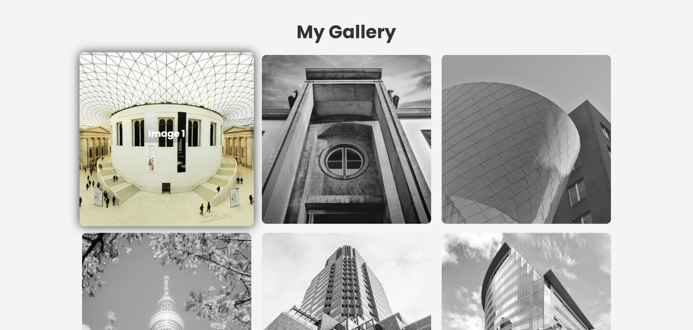

# My Gallery Project

A simple and elegant gallery showcasing smooth animations and responsive design.

---

## 🚀 Screenshots


---

## 🌟 Features
- 📱 Responsive design for all devices.
- 🎨 CSS animations for smooth transitions.
- 🖼️ Minimalistic and user-friendly interface.

---

## 🛠️ Technologies Used
 

---

## ⚙️ Installation
1. Clone the repository:
   ```bash
   git clone https://github.com/ashmita41/practiceproject.git
   ```
2. Open `index.html` in your browser.

---

## 📚 What I Learned
- 🌀 Improved my CSS animation skills.
- 📐 Learned how to make layouts responsive using media queries.

---

## 🔮 Future Enhancements
- 🌙 Add a dark mode toggle.
- 📷 Implement a dynamic image loader using JavaScript.

---

📫 Connect with me: [LinkedIn](https://linkedin.com/in/ashmitapandey47) | [GitHub](https://github.com/ashmita41)
